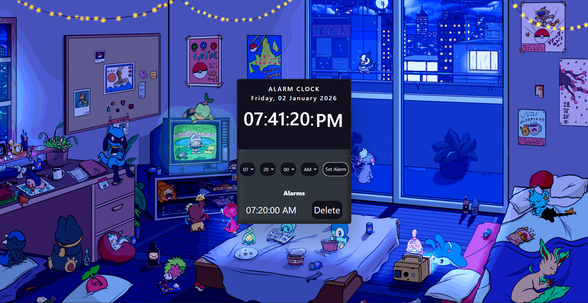

# 🌙 nocturne.alarm

> A serene, Pokémon-inspired web alarm clock for peaceful mornings and dreamy nights.  
> Built with pure HTML, CSS, and JavaScript — no frameworks, just calm vibes and clean code.

  

---

## 🌌 About

`nocturne.alarm` is a minimal, browser-based alarm clock with a cozy bedroom aesthetic inspired by Pokémon's tranquil night scenes. Designed for students, night owls, or anyone who wants their alarm to feel less like a jolt and more like a gentle nudge from a sleepy Squirtle.

Perfect as:

- A frontend practice project 🎓  
- A personal productivity tool 🕰️  
- A cute addition to your coding portfolio 💙  

All code is **handwritten**, **easy to read**, and follows clean coding principles — ideal for learning or academic submission.

---

## ✨ Features

- 🕓 Real-time digital clock (24-hour format)  
- ⏰ Set custom alarms with hour/minute/second selectors  
- 🔊 Plays a soft alarm sound (`Alarm-ringtone.mp3`)  
- 🎨 Calming blue-night UI with animated background  
- 📱 Responsive layout (works on most screen sizes)  
- 🧼 Lightweight & dependency-free (no npm, no frameworks)

---

## 🚀 How to Run

1. Clone this repository:

   ```bash
   git clone https://github.com/haninhammoud01/nocturne.alarm.git
   cd nocturne.alarm

2. Open the app:
   - Double-click Alarm Clock.html to open it in your browser, or
   - Serve it locally (recommended for reliable audio playback):
     
   ```
   bash
   1 npx serve
   ```
   
   Then open http://localhost:3000 in your browser.
💡 Some browsers block autoplay or local file audio for security. Using npx serve avoids this issue.
